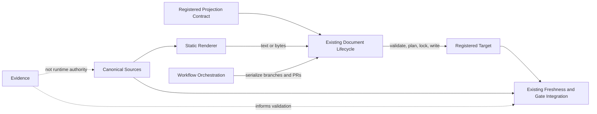

# DPA-000 — Vision and Architectural Principles

Status: review-ready
Status-date: 2026-07-14
Superseded-by: n/a

## 1. Purpose

This specification defines the vision, scope, architectural boundaries and governing principles of the Document Projection Architecture (DPA).

DPA extends the existing `agentic-project-kit` document-management system so that selected registered documents MAY be deterministic projections of canonical repository-backed state. DPA does not replace the existing registry, lifecycle, freshness, evidence, workspace or gate architecture.

## 2. Problem statement

Repository documents may combine current operational state, generated material and historical prose. A writer may refresh one region while readers consume another. Marker-presence checks may prove structure without proving that the consumed projection matches its declared sources. Local mutation locks may protect one process while concurrent branches or pull requests still race.

DPA addresses these problems by defining explicit projection contracts, deterministic rendering, lifecycle-owned mutation, freshness semantics and workflow-level serialization.

## 3. Vision

A registered projected document is a governed view of declared canonical sources. Its bytes are reproducible, its authority is explicit, its drift is detectable, its mutation is lifecycle-controlled, and its rollout is reversible.

The architecture MUST make the following distinctions visible:

- facts versus rendered representation;
- runtime authority versus evidence;
- renderer computation versus lifecycle mutation;
- local locking versus branch and pull-request serialization;
- planned implementation versus verified implementation;
- current projection versus historical evidence.

## 4. Scope

DPA defines:

- terminology and authority classes;
- projected-document forms and source relationships;
- optional registry contract extensions;
- renderer resolution and execution boundaries;
- lifecycle planning, validation, locking and writing responsibilities;
- freshness, drift and gate behavior;
- branch and pull-request concurrency controls;
- migration, rollback and compatibility requirements;
- DP1–DP5 implementation and validation requirements;
- traceability from motivation through evidence and rollback.

## 5. Non-goals

DPA MUST NOT:

- create a second documentation registry;
- create a second lifecycle, freshness, evidence, workspace or gate subsystem;
- introduce arbitrary runtime plugins through registry data;
- make evidence a runtime source of truth;
- add a canonical history store merely to simplify migration;
- automatically merge historical prose during drift recovery;
- declare a production document migratable without fresh main-repository validation;
- place production kit code in this lab;
- treat model agreement as repository evidence;
- turn the lab into a runtime dependency.

## 6. Architectural invariants

### 6.1 Authority and state

1. Canonical state MUST own facts and MUST NOT own rendering logic.
2. A projection MUST NOT become an independent canonical truth source.
3. Evidence MUST NOT be runtime authority.
4. The final runtime projection contract MUST live in the main repository's existing registry and lifecycle architecture.
5. Repository-specific implementation claims MUST remain `NEEDS_MAIN_REPO_VALIDATION` until verified at an exact ref.

### 6.2 Renderer boundary

6. A renderer MUST be a deterministic computation over declared inputs and explicit configuration.
7. A renderer MUST return text or bytes only.
8. A renderer MUST NOT write files, acquire mutation locks, mutate canonical state, invoke Git operations or trigger another renderer.
9. A renderer MUST compute exactly one registered target.
10. Renderer identifiers MUST resolve through static, reviewed code and MUST fail loudly when unknown.
11. Registry data MUST describe a bounded contract and MUST NOT name arbitrary executable imports.

### 6.3 Lifecycle boundary

12. The existing document lifecycle MUST validate projection contracts, plan changes, acquire the local mutation lock and perform target writes.
13. The lifecycle MUST NOT invent domain state.
14. Mutation-capable operations MUST default to dry-run unless an existing governed workflow explicitly authorizes execution.
15. Production paths MUST resolve through the main repository's existing Workspace abstraction.

### 6.4 Freshness and gates

16. Projection freshness MUST be derived from declared sources, renderer identity/version inputs and target content, not from wall-clock age alone.
17. Time passage alone MUST NOT cause a hard failure.
18. Drift detection MUST distinguish structural invalidity, source drift, target drift and unverifiable state.
19. Projection findings SHOULD integrate with the existing lifecycle finding model and standard gates.
20. Unknown renderer identifiers, malformed contracts and non-reproducible output MUST fail loudly.

### 6.5 Concurrency

21. Local mutation locking MUST NOT be represented as cross-branch or cross-pull-request serialization.
22. Workflow orchestration MUST serialize projection refresh across branches and pull requests where shared targets can race.
23. A governed refresh MUST capture a base SHA, declared source hashes and a target-region or full-target hash.
24. Before merge or final mutation, the workflow MUST verify reproducibility against fresh authoritative repository state.
25. On drift, automation MUST block and regenerate from fresh state; it MUST NOT auto-merge historical prose.

### 6.6 Migration and reversibility

26. Migration form MUST be selected from evidence gathered against a fresh main repository.
27. Full projection SHOULD be preferred only when the complete target is reconstructable from existing canonical sources.
28. Split current projection and historical evidence SHOULD be preferred when historical prose is not canonical.
29. Managed head plus append history MAY be used only as a justified exception with complete workflow serialization and explicit rollback.
30. Every production rollout MUST define rollback, compatibility and evidence requirements before mutation.

## 7. Architectural model

## 8. Responsibility allocation

| Component | Owns | Must not own |
|---|---|---|
| Canonical source | Repository-backed facts | Rendering or target mutation |
| Registry | Declarative projection contract | Arbitrary executable plugin loading |
| Renderer | Deterministic target computation | Writes, locks, Git, orchestration |
| Lifecycle | Validation, planning, local locking, writes | Domain-state invention |
| Workflow orchestration | Cross-branch and cross-PR serialization | Document semantics |
| Freshness/gates | Findings and enforcement | New canonical state |
| Evidence | Reproducible proof and audit inputs | Runtime authority |

## 9. Decision hierarchy for document form

DP1 MUST classify each candidate using this order:

1. **Full projection** — only when all target content is reconstructable from existing canonical sources.
2. **Split projection and historical evidence** — when current state is reconstructable but historical prose is not canonical.
3. **Managed head plus append history** — only as an explicitly justified exception.
4. **No migration** — when authority, readers, writers or rollback cannot be established safely.

No classification is verified until the real reader/writer/source graph has been inspected at a fresh main-repository ref.

## 10. Quality attributes

A conforming DPA design MUST be:

- deterministic;
- fail-loud;
- backwards-compatible by default;
- incrementally adoptable;
- reversible;
- traceable;
- testable without fabricated evidence;
- integrated with existing governance;
- explicit about authority and uncertainty.

## 11. Success criteria

DPA succeeds when:

- projected targets are reproducible from declared sources;
- readers consume a projection whose authority and freshness are explicit;
- renderers remain pure and bounded;
- lifecycle and gate integration reuse existing mechanisms;
- concurrent branch and pull-request refreshes cannot silently overwrite each other;
- migration does not invent a new truth source;
- rollback is defined and tested;
- DP1–DP5 can be implemented in the main repository without architectural ambiguity.

## 12. Traceability anchors

The following identifiers are normative anchors for later traceability:

- `DPA-GOAL-001` — deterministic registered document projections;
- `DPA-GOAL-002` — exclusive reuse of existing document-management architecture;
- `DPA-GOAL-003` — explicit authority and evidence boundaries;
- `DPA-GOAL-004` — lifecycle-owned mutation and pure renderers;
- `DPA-GOAL-005` — freshness and fail-loud drift detection;
- `DPA-GOAL-006` — cross-branch and cross-PR serialization;
- `DPA-GOAL-007` — evidence-driven, reversible migration;
- `DPA-GOAL-008` — implementation-ready DP1–DP5 contract.

## 13. Validation status

The architectural principles in this document are `NORMATIVE` for the lab.

Concrete main-repository module names, registry fields, reader/writer graphs, candidate document forms and gate wiring remain `NEEDS_MAIN_REPO_VALIDATION` until inspected against a fresh `origin/main` and recorded under `evidence/repo-facts/`.
