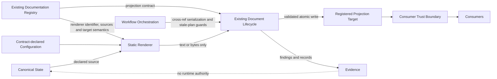

# DPA-100 — Foundations and Terminology

Status: stable
Status-date: 2026-07-15
Superseded-by: n/a

## 1. Purpose

This specification defines the normative vocabulary, authority classes, state classifications and foundational relationships used by the complete DPA series.

DPA documents MUST use these terms consistently. A later specification MAY refine a term for its own scope but MUST NOT change its meaning without an accepted decision and corresponding update to this document.

## 2. Closed vocabulary model

DPA-ADR-009 separates four dimensions that MUST NOT be combined into compound statuses.

### 2.1 Repository-fact and architecture classifications

- `VERIFIED`: supported by an exact repository ref and reproducible evidence sufficient for the claim at the time of use;
- `VERIFIED_AT_RECORDED_BASELINE`: supported by an exact historical ref and a minimal static evidence record conforming to DPA-ADR-011; revalidation remains mandatory before later implementation;
- `ASSUMPTION`: a working belief not yet validated against the relevant authority;
- `NORMATIVE`: an adopted architecture or governance rule;
- `PROPOSAL`: a candidate design not yet accepted;
- `REJECTED`: an explicitly declined alternative with rationale;
- `NEEDS_MAIN_REPO_VALIDATION`: a repository-specific claim that cannot guide implementation until checked against an exact validation ref.

Model agreement MUST NOT be classified as `VERIFIED` or `VERIFIED_AT_RECORDED_BASELINE`.

### 2.2 Document status

- `planned`: a named stub or future document whose reviewable content does not yet exist;
- `draft`: structure and unresolved concepts exist, but formal review readiness is not claimed;
- `review-ready`: terminology, alternatives, assumptions and initial traceability are sufficient for formal review;
- `stable`: required reviews and decisions are adjudicated and no known contradiction remains for the document scope;
- `adopted`: the contract has been validated and accepted into the main repository;
- `active`: a living governance, status, planning or operational document that is maintained continuously rather than progressing through the specification lifecycle.

### 2.3 Progress status

- `pending`: not yet started or awaiting a prerequisite;
- `partial`: started but incomplete;
- `complete`: completed for the explicitly stated scope;
- `blocked`: cannot proceed because a named prerequisite or stop condition is unresolved;
- `not-required`: deliberately excluded because the governing requirement is satisfied by another valid path.

### 2.4 Access outcome

- `accessible`: required sources were actually read;
- `access-blocked`: required sources could not be read.

An access outcome is not an architecture verdict.

## 3. Repository roles

### 3.1 Main repository

The **main repository** is `vfi64/agentic-project-kit`. It is the only authority for production implementation, runtime contracts, Direction state, registry contents, lifecycle behavior, gates, releases and handoff state.

### 3.2 Lab repository

The **lab repository** is `vfi64/agentic-project-kit-dpa-lab`. It is authoritative only for its own planning history, accepted architecture decisions and normative DPA specifications before controlled import. It is not a runtime dependency and not an authority for current main-repository behavior.

### 3.3 Lab adoption

**Lab adoption** is the governed act of operating the lab with the kit after DPA-000 through at least DPA-500 and the lab governance contracts are stable. Lab adoption MUST remain reversible and MUST NOT make the lab authoritative for main-repository runtime state.

### 3.4 Controlled import

**Controlled import** is the selective transfer of approved normative artifacts or translated runtime contracts into the main repository after validation against a validation ref. The lab MUST NOT be imported wholesale.

## 4. Authority terms

### 4.1 Runtime authority

**Runtime authority** is the accepted source that owns a fact or operational contract during production execution. Runtime authority belongs only to accepted main-repository state and contracts.

### 4.2 Canonical state

**Canonical state** is repository-backed runtime authority for a defined set of domain facts. Canonical state MUST be independently identified before a projection may claim to represent it.

Canonical state MUST NOT contain rendering logic merely because a projection consumes it.

### 4.3 Runtime authority wording

The informal phrases **source of truth** and **runtime truth source** SHOULD be avoided in normative text. Specifications MUST instead name the exact authority type, scope and repository location.

### 4.4 Projection authority

**Projection authority** is the bounded authority delegated by a validated registry contract to derive one target from declared canonical sources. It does not make the target an independent canonical source.

### 4.5 Planning authority

**Planning authority** is authority over architecture planning within the lab. It does not imply runtime authority.

### 4.6 Evidence

**Evidence** is a reproducible record of inspection, planning, rendering, validation, writing, test or gate activity. Evidence can support a claim but MUST NOT become runtime authority by convenience or repetition.

### 4.7 Historical record

A **historical record** preserves prior context or prose. It may have evidentiary or human value without being canonical state. Historical records MUST NOT be automatically merged into a regenerated projection after drift.

## 5. Document terms

### 5.1 Registered document

A **registered document** is a target governed by the existing main-repository documentation registry.

### 5.2 Registered region

A **registered region** is a precisely bounded portion of a registered document whose boundary representation, write ownership, normalization and drift semantics are declared by contract. Whether the current main-repository registry supports region-level registration is `NEEDS_MAIN_REPO_VALIDATION`.

### 5.3 Projection target

A **projection target** is a registered document or registered region whose expected bytes are computed from a projection contract.

### 5.4 Target semantics

**Target semantics** define how renderer output maps to the target, including full replacement or region replacement, encoding, line-ending and normalization rules, boundary handling and prohibited append behavior. DPA-200 owns the complete target-semantics model.

### 5.5 Projection contract

A **projection contract** is the declarative registry-owned definition that binds:

- one target;
- one renderer identifier;
- declared canonical sources;
- target semantics;
- contract-declared configuration;
- relevant lifecycle and freshness policy;
- version or compatibility information required for deterministic reproduction.

A projection contract MUST NOT contain an arbitrary executable import path.

### 5.6 Declared source and canonical source

A **declared source** is a canonical input named by the projection contract. A **canonical source** is a declared source that belongs to canonical state for the facts consumed by the renderer. Evidence and historical prose MUST NOT be declared as semantic sources unless an independent accepted authority decision first makes them canonical state.

A renderer MUST NOT depend on undeclared repository content for semantic output.

### 5.7 Contract-declared configuration

**Contract-declared configuration** is versioned, non-canonical renderer input explicitly named by the projection contract when it affects output, such as normalization, locale or line-ending policy. It MUST be fingerprinted when relevant and MUST NOT become a hidden semantic source.

### 5.8 Projection

A **projection** is the deterministic text or bytes computed for one projection target from declared canonical sources, renderer identity and contract-declared configuration.

### 5.9 Full projection

A **full projection** computes the complete target content from canonical sources.

### 5.10 Split projection

A **split projection** separates a current deterministic projection from historical evidence or prose that is not canonical.

### 5.11 Managed-head projection

A **managed-head projection** computes only a designated leading registered region while preserving an append-only historical region. It is an exceptional form and requires complete workflow serialization, explicit write ownership and migration justification.

### 5.12 Manual document

A **manual document** is a registered document without a projection contract. Existing lifecycle behavior MUST remain unchanged for manual documents.

### 5.13 Hybrid document

A **hybrid document** combines projected and manually maintained regions. Hybrid form MUST NOT be assumed safe; it requires explicit boundaries, ownership and drift semantics in DPA-200 and DPA-700.

## 6. Component terms

### 6.1 Renderer

A **renderer** is statically reviewed code that accepts resolved declared sources and contract-declared configuration and returns exactly one target as text or bytes.

A renderer MUST be mutation-free with respect to the repository. It MUST NOT write, lock, commit, invoke workflows, trigger another renderer or invent canonical facts.

### 6.2 Renderer identifier

A **renderer identifier** is a stable declarative name stored in the projection contract and resolved through a static reviewed mapping.

Unknown identifiers MUST fail loud.

### 6.3 Renderer resolution

**Renderer resolution** maps an approved renderer identifier to reviewed implementation code. Dynamic import from registry-controlled strings is prohibited.

### 6.4 Document lifecycle

The **document lifecycle** is the existing main-repository mechanism that validates document contracts, plans mutations, acquires the mutation lock, writes targets and emits findings and evidence.

Exact module and command names are `NEEDS_MAIN_REPO_VALIDATION`.

### 6.5 Workflow orchestration

**Workflow orchestration** coordinates refresh activity across repository refs, branches and pull requests. It validates that a previously computed plan still applies before integration.

### 6.6 Workspace

The **Workspace** is the existing main-repository path-resolution abstraction. Production DPA paths MUST resolve through it after validated implementation.

### 6.7 Gate

A **gate** is an existing governed pass, warning or failure decision used by the main repository. DPA findings MUST integrate with existing gate architecture rather than create a parallel gate suite.

### 6.8 Consumer trust boundary

The **consumer trust boundary** is the point at which a generated target may be treated as accepted repository state. Rendered bytes before required lifecycle validation and gate completion MUST NOT be represented as accepted state. DPA-200 and DPA-500 own the complete consumer and gate contract.

## 7. State and reproducibility terms

### 7.1 Deterministic

A renderer is **deterministic** when identical declared sources, renderer identity and contract-declared configuration produce identical target bytes.

### 7.2 Reproducible

A projection is **reproducible** when an independent conforming invocation at the required repository ref produces the expected target bytes and fingerprints.

### 7.3 Fresh

A projection target is **fresh** when it is reproducible from the currently authoritative declared sources under the active projection contract.

Freshness is derivational. It is not established by modification time alone.

### 7.4 Validation ref

A **validation ref** is the exact fetched main-repository commit against which repository-specific claims, compatibility and implementation behavior are inspected. The phrase `fresh main` MUST be replaced by an exact validation-ref requirement in normative text.

### 7.5 Drift

**Drift** is a mismatch among the authoritative source state, projection contract, renderer identity, planned target fingerprint or actual target bytes.

DPA-500 and DPA-600 define drift classes and gate consequences.

### 7.6 Source drift

**Source drift** occurs when a declared source changes after a plan or render fingerprint was captured.

### 7.7 Target drift

**Target drift** occurs when the target changes after a plan or expected fingerprint was captured.

### 7.8 Base drift

**Base drift** occurs when the repository base ref used to produce a plan no longer matches the required integration base.

### 7.9 Contract drift

**Contract drift** occurs when the registry projection contract or renderer identity changes relative to the captured plan.

### 7.10 Temporal signal

A **temporal signal** is a time-derived warning or review input. Time passage alone MUST NOT produce a hard failure.

### 7.11 Fingerprint

A **fingerprint** is a reproducible digest over defined bytes and normalization rules. Every fingerprint contract MUST state its input domain and algorithm.

## 8. Mutation terms

### 8.1 Dry-run

A **dry-run** resolves, validates, renders and plans without writing the projection target. Mutation-capable DPA commands MUST default to dry-run.

### 8.2 Mutation plan

A **mutation plan** is a bounded description of the target change plus captured base, source, target and contract fingerprints required to detect staleness.

A mutation plan is evidence, not runtime authority.

### 8.3 Mutation lock

The **mutation lock** is the existing local workspace lock used by the document lifecycle while validating and applying a write.

A mutation lock does not serialize independent branches or pull requests.

### 8.4 Atomic write

An **atomic write** replaces the governed target without exposing a partially written target. Exact filesystem behavior is `NEEDS_MAIN_REPO_VALIDATION`.

### 8.5 Stale plan

A **stale plan** is a mutation plan whose captured base, source, target or contract fingerprint no longer matches the required write context. A stale plan MUST NOT be applied.

## 9. Workflow terms

### 9.1 Local serialization

**Local serialization** prevents overlapping mutations inside one governed workspace process boundary.

### 9.2 Cross-branch serialization

**Cross-branch serialization** prevents independently valid branch refreshes from being integrated without revalidation against the chosen base.

### 9.3 Cross-PR serialization

**Cross-PR serialization** ensures that competing pull requests cannot both rely on obsolete projection assumptions at merge time.

### 9.4 Refresh workflow

A **refresh workflow** resolves a projection contract, computes expected output, plans or applies a lifecycle mutation, and records bounded evidence.

### 9.5 Regeneration

**Regeneration** recomputes the target from authoritative sources at the validation ref. On drift, regeneration is preferred over textual merge.

## 10. Review and completion terms

### 10.1 Primary architecture review

A **primary architecture review** is a non-normative, exact-ref review of architecture coherence, boundaries, terminology, decisions and risks.

### 10.2 Secondary technical verification

A **secondary technical verification** checks the architecture and primary findings against exact repository content. It need not be a blind independent first review, but its method and prior exposure MUST be disclosed.

### 10.3 Maintainer adjudication

**Maintainer adjudication** accepts, modifies or rejects review findings and records normative decisions.

### 10.4 Consolidated review

A **consolidated review** records primary review, secondary verification and maintainer dispositions. It remains non-normative until accepted decisions and specification changes are committed.

### 10.5 Review result

A completed review uses one architecture verdict from the governing review contract. Access failure, incomplete input and execution status are not review results.

## 11. DP1–DP5 terms

- **DP1**: proof-of-architecture and evidence against a validation ref;
- **DP2**: first production projection integrated into the existing system;
- **DP3**: controlled rollout to additional handoff or bootstrap documents;
- **DP4**: status-authority discovery and conditional migration;
- **DP5**: staged strict adoption through the existing lifecycle gate.

DP1–DP5 are planned implementation slices until exact main-repository evidence proves otherwise.

## 12. Required authority rules

1. A projection target MUST NOT be treated as an independent canonical source for the facts it renders.
2. Evidence MUST NOT be read as runtime state by production behavior.
3. Registry contracts MUST be declarative and statically resolved.
4. Renderers MUST read declared sources and contract-declared configuration only for output.
5. The lifecycle MUST be the sole writer of projection targets.
6. Workflow orchestration MUST own cross-ref serialization, not renderer code.
7. Manual and projected regions MUST have explicit ownership.
8. A repository-specific claim without exact evidence MUST remain `NEEDS_MAIN_REPO_VALIDATION` or `ASSUMPTION`.
9. Review findings MUST NOT change normative meaning without adjudication.
10. A planned DP slice MUST NOT be represented as completed implementation.
11. Unvalidated rendered bytes MUST NOT be represented as accepted repository state.

## 13. Ambiguous terms prohibited in normative use

The following words require qualification and SHOULD NOT appear alone in normative requirements:

- `current` — identify current relative to which authority and ref;
- `latest` — identify selection rule and ref;
- `safe` — identify protected invariant or failure mode;
- `valid` — identify validator and contract;
- `fresh` — use the derivational definition in this document;
- `history` — distinguish canonical history, evidence and prose;
- `state` — identify owner and scope;
- `source` — distinguish declared source, evidence source and repository location.

## 14. Foundational relationship model

## 15. Main-repository validation boundary

The following terms are normative abstractions, while their concrete implementation remains `NEEDS_MAIN_REPO_VALIDATION`:

- registry projection field names;
- lifecycle module and command names;
- finding identifiers and severity mapping;
- Workspace methods and path fields;
- mutation-lock API;
- workflow and merge-queue mechanism;
- candidate document classification;
- canonical sources for any candidate target.

## 16. Conformance

A DPA specification conforms to DPA-100 when it:

1. uses authority terms consistently;
2. does not promote evidence or projections to canonical state implicitly;
3. distinguishes local locking from cross-ref serialization;
4. classifies repository-specific claims;
5. distinguishes planned, verified and adopted states;
6. uses renderer, lifecycle and registry boundaries defined here;
7. records any intentional terminology change through an accepted decision.