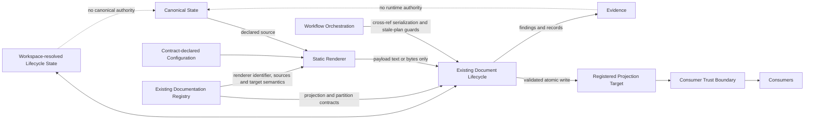

# DPA-100 — Foundations and Terminology

Status: stable

Status-date: 2026-07-15

Superseded-by: n/a

## 1. Purpose

This specification defines the normative vocabulary, authority classes, state classifications and foundational relationships used by the complete DPA series.

DPA documents MUST use these terms consistently. A later specification MAY refine a term for its own scope but MUST NOT change its meaning without an accepted decision and a synchronized update to this document.

This file is the sole normative DPA-100 vocabulary owner.

## 2. Closed vocabulary model

DPA-ADR-009 separates repository classification, document status, progress and access outcome. DPA-ADR-014 adds consumer trust state. These dimensions MUST NOT be combined into undeclared compound statuses.

### 2.1 Repository-fact and architecture classifications

- `VERIFIED`: supported by an exact repository ref and reproducible evidence sufficient for the claim at the time of use;
- `VERIFIED_AT_RECORDED_BASELINE`: supported by an exact historical ref and a minimal static evidence record conforming to DPA-ADR-011; revalidation remains mandatory before later implementation;
- `ASSUMPTION`: a working belief not yet validated against the relevant authority;
- `NORMATIVE`: an adopted architecture or governance rule;
- `PROPOSAL`: a candidate design not yet accepted;
- `REJECTED`: an explicitly declined alternative with rationale;
- `NEEDS_MAIN_REPO_VALIDATION`: a repository-specific claim that cannot guide implementation until checked against an exact validation ref.

Model agreement MUST NOT be classified as `VERIFIED` or `VERIFIED_AT_RECORDED_BASELINE`.

### 2.2 Document status

- `planned`: a named stub or future document whose reviewable content does not yet exist;
- `draft`: structure and unresolved concepts exist, but formal review readiness is not claimed;
- `review-ready`: terminology, alternatives, assumptions and initial traceability are sufficient for formal review;
- `stable`: required reviews and decisions are adjudicated and no known contradiction remains for the document scope;
- `adopted`: the contract has been validated and accepted into the main repository;
- `active`: a living governance, status, planning or operational document maintained continuously.

### 2.3 Progress status

- `pending`;
- `partial`;
- `complete`;
- `blocked`;
- `not-required`.

Every use MUST state the scope whose progress is described.

### 2.4 Access outcome

- `accessible`;
- `access-blocked`.

An access outcome is not an architecture verdict.

### 2.5 Consumer trust state

Consumer trust state is the closed vocabulary for generated or projected bytes:

- `computed`: one renderer invocation produced bytes, but no immutable mutation plan owns them;
- `plan-captured`: an immutable lifecycle mutation plan owns the intended output and all required guards;
- `written-unverified`: the lifecycle wrote the bytes, but required post-write verification, evidence and gates are incomplete;
- `accepted`: the complete required gate set accepted the bytes for the declared scope;
- `abandoned`: the refresh instance ended through rejection, failure, invalidation or detected interruption and cannot later become accepted.

DPA-200 owns the architectural model. DPA-300 owns lifecycle transitions and interrupted-instance recovery. DPA-500 owns gate consequences and the transition to `accepted`.

The document-status token `planned` MUST NOT be used as a consumer trust state. A trust-state token MUST NOT be reused with another meaning in a different vocabulary dimension.

## 3. Repository roles

### 3.1 Main repository

The **main repository** is `vfi64/agentic-project-kit`. It is the only authority for production implementation, runtime contracts, Direction state, registry contents, lifecycle behavior, gates, releases and handoff state.

### 3.2 Lab repository

The **lab repository** is `vfi64/agentic-project-kit-dpa-lab`. It is authoritative only for its planning history, accepted architecture decisions and pre-import normative specifications. It is not a runtime dependency or an authority for current main-repository behavior.

### 3.3 Lab adoption

**Lab adoption** is the governed act of operating the lab with the kit after DPA-000 through at least DPA-500 and the governance contracts are stable. It MUST remain reversible and MUST NOT make the lab authoritative for main-repository runtime state.

### 3.4 Controlled import

**Controlled import** is selective transfer of approved normative artifacts or translated runtime contracts into the main repository after validation against a validation ref. The lab MUST NOT be imported wholesale.

## 4. Authority terms

### 4.1 Runtime authority

**Runtime authority** is the accepted source that owns a fact or operational contract during production execution. Runtime authority belongs only to accepted main-repository state and contracts.

### 4.2 Canonical state

**Canonical state** is repository-backed runtime authority for a defined set of domain facts. Canonical state MUST be independently identified before a projection may claim to represent it and MUST NOT own rendering logic merely because a projection consumes it.

### 4.3 Runtime-authority wording

The informal phrases **source of truth** and **runtime truth source** SHOULD be avoided in normative text. Specifications MUST name the exact authority type, scope and repository location.

### 4.4 Projection authority

**Projection authority** is bounded authority delegated by a validated registry contract to derive one target from declared canonical sources. It does not make the target an independent canonical source.

### 4.5 Planning authority

**Planning authority** is authority over architecture planning within the lab. It does not imply runtime authority.

### 4.6 Evidence

**Evidence** is a reproducible record of inspection, planning, rendering, validation, writing, testing or gate activity. Evidence supports claims but MUST NOT become runtime authority, canonical state or semantic renderer input.

### 4.7 Historical record

A **historical record** preserves prior context or prose. It may have evidentiary or human value without being canonical state. It MUST NOT be automatically merged into a regenerated projection after drift.

### 4.8 Lifecycle state

**Lifecycle state** is non-canonical operational state owned by the existing document lifecycle and resolved through Workspace. It may govern later lifecycle behavior without becoming evidence or canonical domain state.

An **acceptance-state record** is lifecycle state containing the accepted plan and fingerprints required to classify later drift. It MUST NOT be stored only as evidence and MUST NOT become a semantic renderer input.

## 5. Document terms

### 5.1 Registered document

A **registered document** is a target governed by the existing main-repository documentation registry.

### 5.2 Registered region

A **registered region** is a precisely bounded portion of a registered document whose identity, write ownership, normalization and drift semantics are declared by contract. Region-level representability in the current registry remains `NEEDS_MAIN_REPO_VALIDATION`.

### 5.3 Partition contract

A **partition contract** is the single document-level registry contract that explains every byte of a registered multi-region document, including region order, owner class, boundary representation, separators, normalization and malformed-boundary behavior.

Partition bytes are lifecycle-owned. A renderer MUST NOT own or emit them unless a later accepted decision changes DPA-ADR-013.

### 5.4 Projection target

A **projection target** is a registered document or registered region whose expected bytes are computed from a projection contract.

### 5.5 Target semantics

**Target semantics** define how renderer output maps to the target, including replacement mode, encoding, line endings, normalization, terminal newline, boundary behavior and prohibited append behavior. DPA-200 owns the complete model.

### 5.6 Projection contract

A **projection contract** is the declarative registry-owned definition binding one target, one renderer identifier, declared canonical sources, target semantics, contract-declared configuration, lifecycle/freshness policy and version information required for deterministic reproduction.

It MUST NOT contain an arbitrary executable import path.

### 5.7 Declared source and canonical source

A **declared source** is a canonical input named by the projection contract. A **canonical source** is a declared source that belongs to canonical state for the consumed facts.

Evidence and historical prose MUST NOT be declared as semantic sources without an independent accepted authority decision. A renderer MUST NOT depend on undeclared repository content for semantic output.

### 5.8 Contract-declared configuration

**Contract-declared configuration** is versioned, non-canonical renderer input explicitly named by the projection contract when it affects representation. It MUST be fingerprinted when relevant and MUST NOT become a hidden semantic source.

### 5.9 Projection

A **projection** is deterministic text or bytes computed for one target from declared canonical sources, renderer identity and contract-declared configuration.

### 5.10 Document forms

- A **manual document** has no projection contract.
- A **full projection** computes the complete target.
- A **split projection** uses multiple independently registered target identities.
- A **hybrid document** is one document containing projected and non-projected regions under one partition contract.
- A **managed-head projection** is the exceptional hybrid subtype with one leading projected region followed by a historical region.

DPA-200 owns the complete form taxonomy and selection constraints.

## 6. Component terms

### 6.1 Renderer

A **renderer** is statically reviewed code that accepts resolved declared sources and contract-declared configuration and returns exactly one target payload as text or bytes.

It MUST NOT write, lock, commit, invoke workflows, trigger another renderer or invent canonical facts.

### 6.2 Renderer identifier and resolution

A **renderer identifier** is a stable declarative name stored in the projection contract. **Renderer resolution** maps it through a static reviewed mapping. Unknown identifiers MUST fail loud; registry-controlled dynamic imports are prohibited.

### 6.3 Document lifecycle

The **document lifecycle** is the existing main-repository mechanism that validates contracts, renders through approved code, captures plans, acquires the local mutation lock, writes targets, verifies output, maintains lifecycle state and emits findings and evidence.

### 6.4 Workflow orchestration

**Workflow orchestration** coordinates refresh activity across refs, branches and pull requests. It revalidates previously computed plans before integration and MUST NOT define document semantics or write targets directly.

### 6.5 Workspace

The **Workspace** is the existing main-repository path-resolution abstraction. Production DPA paths, including acceptance-state paths, MUST resolve through it after validated implementation.

### 6.6 Gate

A **gate** is an existing governed pass, warning or failure decision. DPA findings MUST integrate with existing gate architecture.

### 6.7 Consumer trust boundary

The **consumer trust boundary** is the point at which projected bytes may be treated as accepted repository state. Bytes before complete lifecycle validation and gate completion MUST NOT be represented as accepted.

## 7. State, reproducibility and drift terms

### 7.1 Deterministic

A renderer is **deterministic** when identical declared sources, renderer identity and contract-declared configuration produce identical output bytes.

### 7.2 Reproducible

A projection is **reproducible** when an independent conforming invocation at the required repository ref produces the expected bytes and fingerprints.

### 7.3 Fresh

A target is **fresh** when it is reproducible from currently authoritative declared sources under the active contract. Freshness is derivational, not timestamp-based.

### 7.4 Validation ref

A **validation ref** is the exact fetched main-repository commit against which repository-specific claims, compatibility and implementation behavior are inspected.

### 7.5 Drift

**Drift** is a mismatch between current state and a captured plan or accepted lifecycle state. The closed drift-class vocabulary is:

- **base drift**: the required repository base differs;
- **source drift**: one or more declared source fingerprints differ;
- **target drift**: target bytes differ from the captured or accepted output while the distinction from source drift is evaluated independently;
- **contract drift**: projection-contract semantics differ;
- **renderer drift**: renderer identity or version fingerprint differs;
- **partition drift**: partition-contract or lifecycle-owned partition bytes differ;
- **ownership drift**: the declared byte-owner mapping differs.

Multiple drift classes MAY coexist. `boundary drift` is retired; normative text MUST use `partition drift`.

DPA-300 owns plan and acceptance-state comparison. DPA-500 owns finding and gate consequences. DPA-600 owns cross-ref guards.

### 7.6 Temporal signal

A **temporal signal** is a time-derived warning or review input. Time passage alone MUST NOT produce a hard failure.

### 7.7 Fingerprint

A **fingerprint** is a reproducible digest over a declared input domain, normalization contract, algorithm and input-domain version. Unknown algorithms or input-domain versions MUST fail loud.

## 8. Mutation terms

### 8.1 Dry-run

A **dry-run** resolves, validates, renders and plans without writing. Mutation-capable DPA commands MUST default to dry-run.

### 8.2 Mutation plan

A **mutation plan** is an immutable bounded description of the intended target change plus captured guards. It is planning evidence, not runtime authority after execution.

### 8.3 Mutation lock

The **mutation lock** is the existing local Workspace lock used by the lifecycle during bounded mutation. It does not serialize independent branches or pull requests.

### 8.4 Atomic write

An **atomic write** exposes either the complete previous target or the complete replacement target, never a partial in-place region mutation. Concrete filesystem behavior remains `NEEDS_MAIN_REPO_VALIDATION`.

### 8.5 Stale plan

A **stale plan** has one or more captured guards that no longer match the required write context. It MUST NOT be applied.

### 8.6 Interrupted refresh

An **interrupted refresh** is a lifecycle instance that lost execution before completing verification, state recording and release. A later lifecycle operation MUST detect and dispose of it under DPA-ADR-016 before a new mutation for the same target proceeds.

## 9. Workflow terms

- **local serialization** prevents overlapping mutations inside one workspace boundary;
- **cross-branch serialization** prevents independently valid branch refreshes from integrating without revalidation;
- **cross-PR serialization** prevents competing pull requests from relying on obsolete projection assumptions;
- a **refresh workflow** resolves a contract, produces a plan, optionally applies the lifecycle mutation and records bounded evidence;
- **regeneration** recomputes generated content from declared canonical sources; it is preferred over textual merge after drift.

## 10. Review and completion terms

### 10.1 Primary architecture review

A **primary architecture review** independently audits a ref-bound architecture baseline against its governing contracts and evidence.

### 10.2 Secondary technical verification

A **secondary technical verification** checks architecture and primary findings against exact repository content and discloses its method and prior exposure.

### 10.3 Maintainer adjudication

**Maintainer adjudication** accepts, modifies or rejects findings and records normative decisions.

### 10.4 Consolidated review

A **consolidated review** records primary review, secondary verification and maintainer dispositions. It remains non-normative until accepted decisions and specification changes are committed.

### 10.5 Review result

A completed review uses one architecture verdict from its governing review contract. Access failure, incomplete input and execution status are not architecture verdicts.

## 11. DP1–DP5 terms

- **DP1**: proof-of-architecture and evidence against a validation ref, internally staged as Discovery, Probe and Assessment;
- **DP2**: first production projection integrated into the existing system;
- **DP3**: controlled rollout to additional handoff or bootstrap documents;
- **DP4**: status-authority discovery and conditional migration;
- **DP5**: staged strict adoption through the existing lifecycle gate.

DP1–DP5 remain planned implementation slices until exact main-repository evidence proves otherwise.

## 12. Required authority rules

1. A projection target MUST NOT become an independent canonical source for rendered facts.
2. Evidence MUST NOT be read as runtime state by production behavior.
3. Lifecycle state MUST NOT become canonical domain state or semantic renderer input.
4. Registry contracts MUST be declarative and statically resolved.
5. Renderers MUST read declared sources and contract-declared configuration only.
6. The lifecycle MUST be the sole writer of projection targets and partition bytes.
7. Workflow orchestration MUST own cross-ref serialization.
8. Manual, historical, projected and partition bytes MUST have explicit ownership.
9. Repository-specific claims without exact evidence remain `NEEDS_MAIN_REPO_VALIDATION` or `ASSUMPTION`.
10. Review findings MUST NOT change normative meaning without adjudication.
11. Planned DP slices MUST NOT be represented as completed implementation.
12. Unvalidated projected bytes MUST NOT be represented as accepted repository state.

## 13. Ambiguous terms prohibited in normative use

The words `current`, `latest`, `safe`, `valid`, `fresh`, `history`, `state` and `source` require qualification by authority, scope, validator and ref.

## 14. Foundational relationship model

## 15. Main-repository validation boundary

Concrete registry field names, lifecycle modules, lifecycle-state paths, finding identifiers, severity mappings, Workspace methods, atomic-write mechanics, workflow serialization and candidate forms remain `NEEDS_MAIN_REPO_VALIDATION` until their governing Probe or implementation evidence exists.

## 16. Conformance

A DPA specification conforms to DPA-100 when it:

1. uses authority, vocabulary, trust and drift terms consistently;
2. does not promote evidence, lifecycle state or projections to canonical state;
3. distinguishes local locking from cross-ref serialization;
4. classifies repository-specific claims;
5. distinguishes planned, verified, accepted and adopted meanings;
6. preserves renderer, lifecycle, registry, Workspace and workflow boundaries;
7. records intentional terminology changes through an accepted decision.
