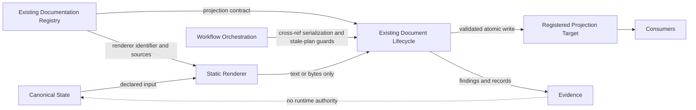

# DPA-100 — Foundations and Terminology

Status: review-ready
Status-date: 2026-07-14
Superseded-by: n/a

## 1. Purpose

This specification defines the normative vocabulary, authority classes, state classifications and foundational relationships used by the complete DPA series.

DPA documents MUST use these terms consistently. A later specification MAY refine a term for its own scope but MUST NOT change its meaning without an accepted decision and corresponding update to this document.

## 2. Normative language

`MUST`, `MUST NOT`, `SHOULD`, `SHOULD NOT` and `MAY` are normative requirement keywords.

Repository-fact classifications are distinct from requirement keywords:

- `VERIFIED`: supported by an exact repository ref and reproducible evidence;
- `ASSUMPTION`: a working belief not yet validated against the relevant authority;
- `NORMATIVE`: an adopted architecture rule;
- `PROPOSAL`: a candidate design not yet accepted;
- `REJECTED`: an explicitly declined alternative with rationale;
- `NEEDS_MAIN_REPO_VALIDATION`: a repository-specific claim that cannot guide implementation until checked against fresh authoritative state.

Model agreement MUST NOT be classified as `VERIFIED`.

## 3. Repository roles

### 3.1 Main repository

The **main repository** is `vfi64/agentic-project-kit`. It is the only authority for production implementation, runtime contracts, Direction state, registry contents, lifecycle behavior, gates, releases and handoff state.

### 3.2 Lab repository

The **lab repository** is `vfi64/agentic-project-kit-dpa-lab`. It is authoritative only for its own planning history, accepted architecture decisions and normative DPA specifications before controlled import. It is not a runtime dependency and not an authority for current main-repository behavior.

### 3.3 Adoption

**Adoption** is the governed act of operating the lab with the kit after DPA-000 through at least DPA-500 and the lab governance contracts are stable. Adoption MUST remain reversible and MUST NOT make the lab authoritative for main-repository runtime state.

### 3.4 Controlled import

**Controlled import** is the selective transfer of approved normative artifacts or translated runtime contracts into the main repository after fresh validation. The lab MUST NOT be imported wholesale.

## 4. Authority terms

### 4.1 Runtime authority

**Runtime authority** is the accepted source that owns a fact or operational contract during production execution. Runtime authority belongs only to accepted main-repository state and contracts.

### 4.2 Canonical state

**Canonical state** is repository-backed runtime authority for a defined set of domain facts. Canonical state MUST be independently identified before a projection may claim to represent it.

Canonical state MUST NOT contain rendering logic merely because a projection consumes it.

### 4.3 Source of truth

**Source of truth** is an informal phrase and SHOULD be avoided in normative text. Specifications MUST instead name the exact authority type, scope and repository location.

### 4.4 Projection authority

**Projection authority** is the bounded authority delegated by a validated registry contract to derive one target from declared canonical sources. It does not make the target an independent canonical source.

### 4.5 Planning authority

**Planning authority** is authority over architecture planning within the lab. It does not imply runtime authority.

### 4.6 Evidence

**Evidence** is a reproducible record of inspection, planning, rendering, validation, writing, test or gate activity. Evidence can support a claim but MUST NOT become runtime authority by convenience or repetition.

### 4.7 Historical record

A **historical record** preserves prior context or prose. It may have evidentiary or human value without being canonical state. Historical records MUST NOT be automatically merged into a regenerated projection after drift.

## 5. Document terms

### 5.1 Registered document

A **registered document** is a target governed by the existing main-repository documentation registry.

### 5.2 Projection target

A **projection target** is a registered document, or a precisely defined registered region of a document, whose expected bytes are computed from a projection contract.

Whether region-level targets are compatible with the real registry is `NEEDS_MAIN_REPO_VALIDATION`.

### 5.3 Projection contract

A **projection contract** is the declarative registry-owned definition that binds:

- one target;
- one renderer identifier;
- declared canonical sources;
- target semantics;
- relevant lifecycle and freshness policy;
- version or compatibility information required for deterministic reproduction.

A projection contract MUST NOT contain an arbitrary executable import path.

### 5.4 Declared source

A **declared source** is a canonical input named by the projection contract. A renderer MUST NOT depend on undeclared repository content for semantic output.

Incidental process inputs such as locale or line-ending policy MUST be fixed by contract or implementation environment when they affect output.

### 5.5 Projection

A **projection** is the deterministic text or bytes computed for one projection target from its declared sources, renderer and relevant versioned configuration.

### 5.6 Full projection

A **full projection** computes the complete target content from canonical sources.

### 5.7 Split projection

A **split projection** separates a current deterministic projection from historical evidence or prose that is not canonical.

### 5.8 Managed-head projection

A **managed-head projection** computes only a designated leading region while preserving an append-only historical region. It is an exceptional form and requires complete workflow serialization and explicit migration justification.

### 5.9 Manual document

A **manual document** is a registered document without a projection contract. Existing lifecycle behavior MUST remain unchanged for manual documents.

### 5.10 Hybrid document

A **hybrid document** combines projected and manually maintained regions. Hybrid form MUST NOT be assumed safe; it requires explicit boundaries, ownership and drift semantics in DPA-200 and DPA-700.

## 6. Component terms

### 6.1 Renderer

A **renderer** is statically reviewed code that accepts resolved declared inputs and returns exactly one target as text or bytes.

A renderer MUST be mutation-free with respect to the repository. It MUST NOT write, lock, commit, invoke workflows, trigger another renderer or invent canonical facts.

### 6.2 Renderer identifier

A **renderer identifier** is a stable declarative name stored in the projection contract and resolved through a static reviewed mapping.

Unknown identifiers MUST fail loud.

### 6.3 Renderer resolution

**Renderer resolution** maps an approved renderer identifier to reviewed implementation code. Dynamic import from registry-controlled strings is prohibited.

### 6.4 Document lifecycle

The **document lifecycle** is the existing main-repository mechanism that validates document contracts, plans mutations, acquires the mutation lock, writes targets and emits findings and evidence.

Exact module and command names are `NEEDS_MAIN_REPO_VALIDATION`.

### 6.5 Workflow orchestration

**Workflow orchestration** coordinates refresh activity across repository refs, branches and pull requests. It validates that a previously computed plan still applies before integration.

### 6.6 Workspace

The **Workspace** is the existing main-repository path-resolution abstraction. Production DPA paths MUST resolve through it after validated implementation.

### 6.7 Gate

A **gate** is an existing governed pass, warning or failure decision used by the main repository. DPA findings MUST integrate with existing gate architecture rather than create a parallel gate suite.

## 7. State and reproducibility terms

### 7.1 Deterministic

A renderer is **deterministic** when identical declared sources, renderer identity and relevant versioned configuration produce identical target bytes.

### 7.2 Reproducible

A projection is **reproducible** when an independent conforming invocation at the required repository ref produces the expected target bytes and fingerprints.

### 7.3 Fresh

A projection target is **fresh** when it is reproducible from the currently authoritative declared sources under the active projection contract.

Freshness is derivational. It is not established by modification time alone.

### 7.4 Drift

**Drift** is a mismatch among the authoritative source state, projection contract, renderer identity, planned target fingerprint or actual target bytes.

DPA-500 and DPA-600 define drift classes and gate consequences.

### 7.5 Source drift

**Source drift** occurs when a declared source changes after a plan or render fingerprint was captured.

### 7.6 Target drift

**Target drift** occurs when the target changes after a plan or expected fingerprint was captured.

### 7.7 Base drift

**Base drift** occurs when the repository base ref used to produce a plan no longer matches the required integration base.

### 7.8 Contract drift

**Contract drift** occurs when the registry projection contract or renderer identity changes relative to the captured plan.

### 7.9 Temporal signal

A **temporal signal** is a time-derived warning or review input. Time passage alone MUST NOT produce a hard failure.

### 7.10 Fingerprint

A **fingerprint** is a reproducible digest over defined bytes and normalization rules. Every fingerprint contract MUST state its input domain and algorithm.

## 8. Mutation terms

### 8.1 Dry-run

A **dry-run** resolves, validates, renders and plans without writing the projection target. Mutation-capable DPA commands MUST default to dry-run.

### 8.2 Mutation plan

A **mutation plan** is a bounded description of the target change plus captured base, source, target and contract fingerprints required to detect staleness.

A mutation plan is evidence, not runtime authority.

### 8.3 Mutation lock

The **mutation lock** is the existing local workspace lock used by the document lifecycle while validating and applying a write.

A mutation lock does not serialize independent branches or pull requests.

### 8.4 Atomic write

An **atomic write** replaces the governed target without exposing a partially written target. Exact filesystem behavior is `NEEDS_MAIN_REPO_VALIDATION`.

### 8.5 Stale plan

A **stale plan** is a mutation plan whose captured base, source, target or contract fingerprint no longer matches the required write context. A stale plan MUST NOT be applied.

## 9. Workflow terms

### 9.1 Local serialization

**Local serialization** prevents overlapping mutations inside one governed workspace process boundary.

### 9.2 Cross-branch serialization

**Cross-branch serialization** prevents independently valid branch refreshes from being integrated without revalidation against the chosen base.

### 9.3 Cross-PR serialization

**Cross-PR serialization** ensures that competing pull requests cannot both rely on obsolete projection assumptions at merge time.

### 9.4 Refresh workflow

A **refresh workflow** resolves a projection contract, computes expected output, plans or applies a lifecycle mutation, and records bounded evidence.

### 9.5 Regeneration

**Regeneration** recomputes the target from fresh authoritative sources. On drift, regeneration is preferred over textual merge.

## 10. Review and completion terms

### 10.1 Individual review

An **individual review** is a non-normative analysis produced by one model or reviewer against an exact commit/ref.

### 10.2 Consolidated review

A **consolidated review** classifies and adjudicates individual findings. It remains non-normative until accepted decisions and normative specifications are updated.

### 10.3 Draft

A document is **draft** when its structure and unresolved concepts are visible but it is not ready for formal review.

### 10.4 Review-ready

A document is **review-ready** when terminology is coherent, alternatives and assumptions are visible, and traceability has begun.

### 10.5 Stable

A document is **stable** only after required reviews are adjudicated, decisions and traceability are complete for its scope, and no known contradiction remains.

### 10.6 Adopted

A contract is **adopted** only after fresh main-repository validation and governed acceptance into the main repository. Lab status alone cannot establish adoption.

## 11. DP1–DP5 terms

- **DP1**: proof-of-architecture and evidence against a fresh main repository;
- **DP2**: first production projection integrated into the existing system;
- **DP3**: controlled rollout to additional handoff or bootstrap documents;
- **DP4**: status-authority discovery and conditional migration;
- **DP5**: staged strict adoption through the existing lifecycle gate.

DP1–DP5 are planned implementation slices until exact main-repository evidence proves otherwise.

## 12. Required authority rules

1. A projection target MUST NOT be treated as an independent canonical source for the facts it renders.
2. Evidence MUST NOT be read as runtime state by production behavior.
3. Registry contracts MUST be declarative and statically resolved.
4. Renderers MUST read declared sources only for semantic output.
5. The lifecycle MUST be the sole writer of projection targets.
6. Workflow orchestration MUST own cross-ref serialization, not renderer code.
7. Manual and projected regions MUST have explicit ownership.
8. A repository-specific claim without exact evidence MUST remain `NEEDS_MAIN_REPO_VALIDATION` or `ASSUMPTION`.
9. Review findings MUST NOT change normative meaning without adjudication.
10. A planned DP slice MUST NOT be represented as completed implementation.

## 13. Ambiguous terms prohibited in normative use

The following words require qualification and SHOULD NOT appear alone in normative requirements:

- `current` — identify current relative to which authority and ref;
- `latest` — identify selection rule and ref;
- `safe` — identify protected invariant or failure mode;
- `valid` — identify validator and contract;
- `fresh` — use the derivational definition in this document;
- `history` — distinguish canonical history, evidence and prose;
- `state` — identify owner and scope;
- `source` — distinguish declared source, evidence source and repository location.

## 14. Foundational relationship model

## 15. Main-repository validation boundary

The following terms are normative abstractions, while their concrete implementation remains `NEEDS_MAIN_REPO_VALIDATION`:

- registry projection field names;
- lifecycle module and command names;
- finding identifiers and severity mapping;
- Workspace methods and path fields;
- mutation-lock API;
- workflow and merge-queue mechanism;
- candidate document classification;
- canonical sources for any candidate target.

## 16. Conformance

A DPA specification conforms to DPA-100 when it:

1. uses authority terms consistently;
2. does not promote evidence or projections to canonical state implicitly;
3. distinguishes local locking from cross-ref serialization;
4. classifies repository-specific claims;
5. distinguishes planned, verified and adopted states;
6. uses renderer, lifecycle and registry boundaries defined here;
7. records any intentional terminology change through an accepted decision.